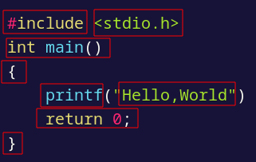
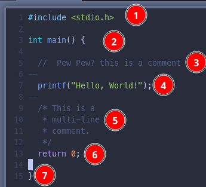

The smallest individual unit in the C program is known as **C Tokens**. **Tokens** are either **keywords** or **identifiers**, **constants**, **variables** or any other symbol which has some meaning in C language. The C program can also be called a collection of various tokens. Hence the syntax for C language defins how to use these tokens together while writing the C language code.

```c
#include <stdio.h>
int main() {
	printf("Hello, Wrodl!");
	return 0;
}
```

> **Every meaningful character, word, symbol in the C language is a token.**

Looking the the above hello world program if we look at the `printf` statement.Here in `printf(Hello, World!);` every C tokens is basically the building block.


The basic repesentation of **C Tokens**

Now let's move on to more important syntax rules, which we must always keep in our mind while writing C code.

### Semicolon (;)

A semicolon `;` is used to mark the end of a statement and the beginning of another statement in the C language. The absence of a semicolon at the ned of any statement will mislead the compiler to think that this statement is not yet finished and it will add the next consecutive statement after it, which may lead to a compilation (syntax) error.

```c
#include <stdio.h>

int main() {
	printf("Hello, World!")
	return 0;
}
```

```
error: expected ';' before 'return' 
return 0; 
^ 
command terminated with exit code 1
```

Here we have omitted the semicolon from the `printf("Hello, world!")` statement, hence the compiler will think that starting from `printf` up until the semicolon after `return 0` statement is a single statement and this will lead to compilation error.

### Comments
1. `//` - for single line comments.
2. `/* */` - multi-line comments.

```c
/* 
	This 
	is a 
	multi-line
	comment.
*/

// This is an inline comment

#include <stdio.h>
int main() {
	// Printing Hello World!
	printf("Hello, World!");
	return 0;
}
```

### Syntax rules of C language
- C is a case-sesitive language so all C instructions must be written in lower case letters. **main** is not the same as **MAIN**.
- All C statements must end with a semicolon.
- Whitespace is used in C to add blank space and tabs.
- We don't have to worry about the indentation of the code.
- When we write a function, its body is enclosed in curly braces, like for the `main()` function.


1. First we have the header part
2. Then we have the `int main()` function
3. Then we have an inline-comment
4. Then we have `printf` printing the string hello world. ending with a semicolon.
5. Then we have a multi-line comment.
6. Then we have the return 0 value.
7. Then opening and closing curly braces.