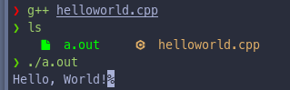

### What is C++?
C++ is a cross-platform language that can be used to create high-performance applications. C++ was developed by **Bjarne Stroustrup** as an extension to the C language. C++ gives programmers a high level of control over system **resources and memory**. The language was updated **3 major times in 2011, 2014, and 2017 to C++ 11, C++14, and C++17**.

### Why use C++?
**C++** is one of the **world's most popular programming languages**. **C++** can be found in today's operating systems, **Graphical User Interfaces**, and **embedded systems**. **C++** is an **object-oriented programming language** which gives a clear structure to programs and **allows code to be reused**, **lowering development costs**. **C++** is portable and can be used to develop applications that can be adapted to multiple platforms. C++ is fun and easy to learn. *As C++ is code to C# and Java, it makes it easy to programmers to from to C++ or vice versa*.

**Requirements:-**
- A text editor, to write C++ code.
- A compiler, like GCC, to translate the C++ code into a language that the computer will understand.

### Starting Code:-

Here is a simple hello world program.
```cpp
#include <iostream>
using namespace std;

int main() {
  cout << "Hello, World!";
  return 0;
}
```


**Explaination**
- `#include <iostream>` is a header file library that lets us work with input and output objects, such as `cout`. Header files add functionality to C++ programs.
- `using namespace std` means that we use names for objects and variables from the standard library.
- A blank line C++ ignores white space. But we use it to make the code more readable.
- Another thing that always appear in a C++ program, in `int main()`. This is the main function. Any code inside its curlybraces `{}` will be executed.
- `cout` is an object used together with the insertion operator (`<<`) to output/print text. In out example it will output "Hello, World!".
	**Note**: Every C++ statement ends with a semicolon `;`.
	**Remember**: The compiler ignores whitespaces. However, multiple lines makes the code more readable.
- `return 0` ends the main function.
- Do not forget to add the closing curlybrace `}` to actually end the main function.

### C++ Output ( Print Text )

The `cout` object, together with the `<<` operator, is used to output values/print text.

#### Example:-
```cpp
#include <iostream>
using namespace std;

int main() {
  cout << "Hello, World!";
  return 0;
}
```

We can add as many `cont` objects as we want. However, the main thing to note is that it does not insert a new line at the end of the output.

```cpp
#include <iostream>
using namespace std;

int main() {
  cout << "This is line 1.";
  cout << "This is line 2.";
  return 0;
}
```

```
❯ g++ cpp_out.cpp
❯ ./a.out
This is line 1.This is line 2.%
```

### C++ New Lines
In C++ to inset a new line we can use `\n` character.

```cpp
#include <iostream>
using namespace std;

int main() {
  cout << "Hello, This is line 1. \n";
  cout << "Hewwo, This is line 2.";
  return 0;
}
```

```
❯ ./a.out
Hello, This is line 1.
Hewwo, This is line 2.% 
```

If we add two `\n` instead of one then it will create a blank line

```cpp
#include <iostream>
using namespace std;

int main() {
  cout << "This is first line. \n\n";
  cout << "This is second line.";
  return 0;
}
```
```
❯ g++ new_lines_two.cpp
❯ ./a.out
This is first line.

This is second line.%  
```

Alternatively, we can use `endl` manipulator to insert a new line.

```cpp
#include <iostream>
using namespace std;

int main() {
  cout << "This is a line" << endl;
  cout << "This is another line.";
  return 0;
}
```
```
❯ g++ endl_line.cpp
❯ ./a.out
This is a line
This is another line.% 
```

### C++ Comments
Comments are used to explain C++ code or make it more readable. It can also be used to prevent execution when testing alternative code. Comments can be single or multi-lined.

```cpp
#include <iostream>
using namespace std;

int main() {
  // This is an inline comment
  cout << "This is a line.";
  /* This is
   * a multi-line comment.
   */
}
```

```
❯ ./a.out
This is a line.%  
```
